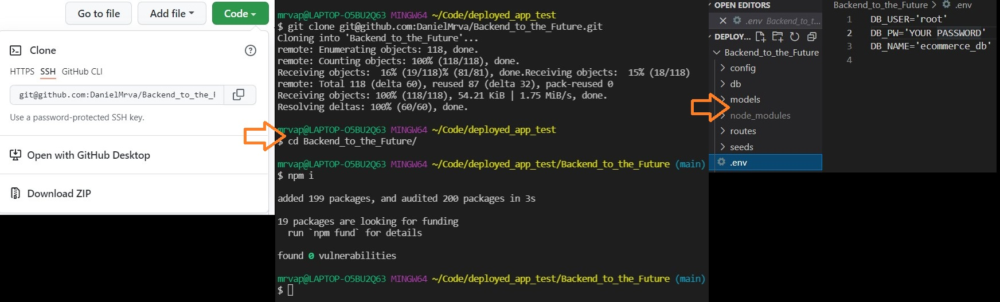
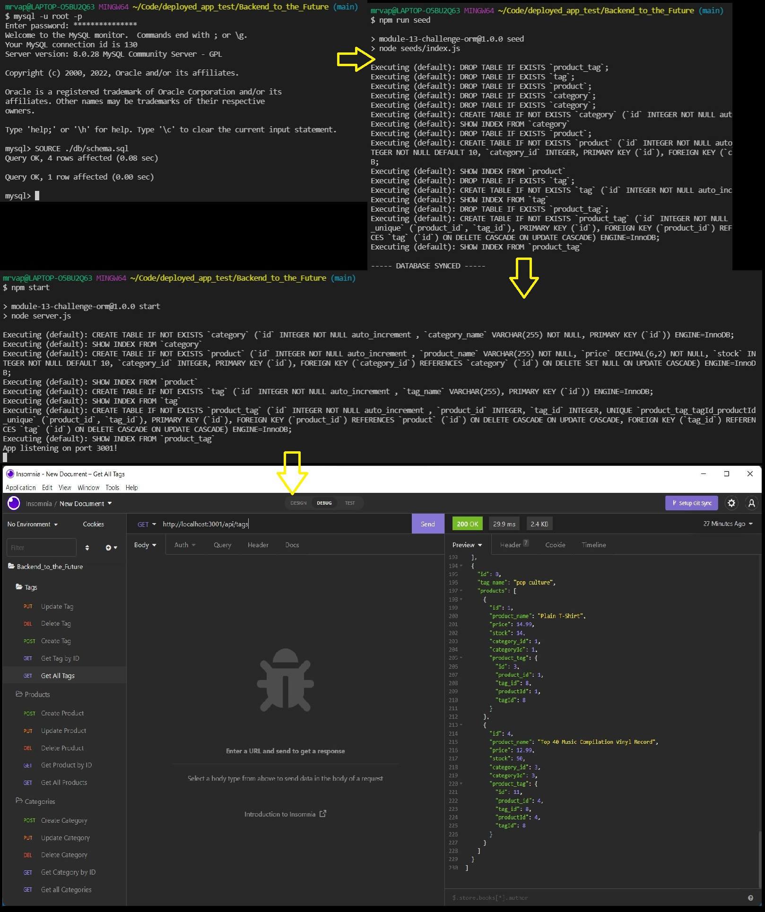

# [Backend to the Future](https://github.com/DanielMrva/Backend_to_the_Future) [](https://opensource.org/licenses/MIT)
  
  ## Description
  Backend to the Future is a basic e-commerce back-end mock-up built using Node JS, MySql, DotENV, Sequelize, to be accessed through a restful API access program like Insomnia.

  ## Table of Conents
   1. [Installation](#installation)
   1. [Usage](#usage)
   1. [Contribution](#contribution)
   1. [Acknowledgements](#acknowledgements)
   1. [Questions](#questions)
   1. [Github Repository](#github-repository)
   1. [License](#license)
  
  ## Installation
  Open github link, click on "Code" button, and copy repo link.

  In Bash navigate to desired parent directory and type "git clone" then paste the repo link.

  Open project in Node terminal or code editor terminal and run "npm intall" to install dependencies.

  In your code editor, you will need to modify the .env.EXAMPLE file name to simply .env, and change the DB_PW='YOUR PASSWORD' on line 2 to your actual password.  Double check the .gitignore file that it has .env listed in ignored files before pushing your copy of the repo up to (for eample) GitHub. 

  ```json
  {"DB_PW": "#########" }
  ```

  This should complete the installation process.

  
  
  ## Usage 
  In terminal log in to your MySql account and run:

  ```Mysql
  SOURCE ./db/schema.sql;
  USE ecommerce_db;
  ```

  Exit Mysql

  From the app's root directory in Bash or your code editor terminal run "npm run seed" to seed the database with starter data, then run "npm start" to run the app. 
  
  From here, you can get JSON-fomrated database query results from a restful-API testing app like [Insomnia](https://insomnia.rest/).

  Your server will run on port 3001, so your routes will look something like:

    * http://localhost:3001/api/categories (get - all categories)
    * http://localhost:3001/api/categories/9 (get - categories by ID "9")
    * http://localhost:3001/api/tags (get - all tags)
    * http://localhost:3001/api/tags/9 (get - tags by ID "9")
    * http://localhost:3001/api/products (get - all products)
    * http://localhost:3001/api/products/9 (get - products by ID  "9")

  Post (create) routes will use the same general format as get - all routes, with the exception of having json bodies formated to their particular models (see category, product, and tag models for further details on Json body structure).
  Put (update) and Delete (destory) routes will use a route format similar to get by ID routes, with the exception of Put routes also requiring a json body structure similar to create routes (again, refer to the models).
     

  

  ## Contribution
  Email my Devmail via github
  
  ## Acknowledgements
  [BenChristensen](https://github.com/b-e-christensen) For debugging help
  
  ## Questions
  Email me any questions to my devmail found on my GitHub profile.

  Feel free to follow or contact me at my GitHub page: [DanielMrva](https://github.com/DanielMrva)
  
  
  ## Github Repository
  [Backend to the Future](https://github.com/DanielMrva/Backend_to_the_Future)

  [Demo](https://watch.screencastify.com/v/doLo9nZ89ul7ive3EHzn)
  
  ## License 
  MIT